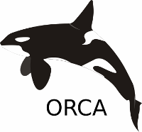

# How to use ORCA

ORCA is a framework focused on productivity. The two main objectives of the framework are: 

1. To run many experiments as easily as possible to compare **many algorithms** and **many datasets**.
2. To provide an easy way of including new algorithms into the framework by simply defining the parameters of the algorithms and the training and test methods.

ORCA has been developed and tested in GNU/Linux systems. Although it may run on Windows and other proprietary operating systems, the following instructions are given for GNU/Linux.

## Download and build ORCA

To download ORCA you can simply clone this GitHub repository by using the following commands:
```bash
git clone https://github.com/ayrna/orca
```

ORCA is programmed in MATLAB, but many of the classification algorithms are implemented in C/C++. Because of this reason, they have to be compiled and packaged into the corresponding `MEX` files.

## Experiments configuration

In the folder [src/config-files](src/config-files) you will find configuration files for running all the algorithms included in ORCA. Here there ir an example for running the Proportion Odds Model (POM), a.k.a. Ordinal Logistic Regression:

```
new experiment
name
pom-real
dir
datasets/ordinal/real/30-holdout
datasets
automobile,balance-scale,bondrate,car,contact-lenses,ERA,ESL,eucalyptus,LEV,marketing,newthyroid,pasture,squash-stored,squash-unstored,SWD,tae,thyroid,toy,winequality-red,winequality-white
algorithm
POM
standarize
1
end experiment
```

The above file tells ORCA to run the algorithm *POM* with the train and test datasets partition at folder *dir*. *standarize* switch on standardization of the data (by using the mean and standard deviation of the train set). Directive *name* is used as and identifier for the experiment set.

## Launch experiments

Assuming you are on the 'src' folder, to launch the bundle of experiments open MATLAB's console and run:

```MATLAB
Utilities.runExperiments('config-files/pom')
```

This should produce and output like this:

```MATLAB
Setting up experiments...
Running experiment exp-pom-real1-ERA-1
Processing Experiments/exp-2015-7-14-9-31-27/exp-pom-real1-ERA-1
Running experiment exp-pom-real1-ERA-10
Processing Experiments/exp-2015-7-14-9-31-27/exp-pom-real1-ERA-10
Running experiment exp-pom-real1-ERA-11
Processing Experiments/exp-2015-7-14-9-31-27/exp-pom-real1-ERA-11
Running experiment exp-pom-real1-ERA-12
Processing Experiments/exp-2015-7-14-9-31-27/exp-pom-real1-ERA-12
...
Calculating results...
```

## Hyper-parameters optimization

Many machine learning methods depends on hyper-parameters to achieve optimal results. ORCA automates parameters optimization by using a grid search using an internal k-fold with the training partition. Let's see an example for optimization of SVORIM cost parameter ('C') and kernel width parameter ('k', a.k.a *gamma*):

```
new experiment
name
svorim-mae-real
dir
datasets/ordinal/real/30-holdout
datasets
automobile,balance-scale,bondrate,car,contact-lenses,ERA,ESL,eucalyptus,LEV,marketing,newthyroid,pasture,squash-stored,squash-unstored,SWD,tae,thyroid,toy,winequality-red,winequality-white
algorithm
SVORIM
num fold
5
standarize
1
crossval
mae
parameter C
10.^(-3:1:3)
parameter k
10.^(-3:1:3)
kernel
rbf
seed
1
end experiment
```

The meaning of each directive are the following:

 - *num fold*: k value for the k-fold cross validation with the training data.
 - *crossval*: metric to select the best hyper-parameters in the grid search. Metrics available are: AMAE,CCR,GM,MAE,MMAE,MS,MZE,Spearman,Tkendall,Wkappa
 - List of hyper-parameters and set of values for the grid search:
  - *parameter C*: add a new parameter with name 'C' and set of values '10.^(-3:1:3)'.
 - Other parameters of the model depends of the specific method, here the kernel type is set up with *kernel* parameter. These are parameters that are not need to be optimized.

 - *seed*: is the value to initialize MATLAB random number generator. This is helpful to debug algorithms.

# Experimental results and reports

ORCA uses the 'Experiments' folder to store experimental results. Each report is placed in a folder named with the current date and time (for example 'exp-2015-7-14-10-5-57'). After a suscessful experiment, this folder should have the following information:

 - Experiments configuration files for each dataset and partition
 - 'Results' folder with the following information:
  - 'mean-results_train.csv' and 'mean-results_test.csv' that contains mean and standard deviation for each one of the ordinal classificacion performance metrics, and the computational time.
  - Train and test confusion matrices.
  - One folder for each dataset including the models ('Models' folder), threshold models one dimensional mapping values ('Guess' folder), labels predictions ('Predictions' folder), optimal hyper-parameters values ('OptHyperparams') and computational time results ('Times').

# Use ORCA with your own datasets

This section teach you how to use ORCA with your own datasets.

## Data format

ORCA used the common MATLAB's file format, this is one pattern per file:

```
attr1 attr2 ... attrN label
attr1 attr2 ... attrN label
attr1 attr2 ... attrN label
```

Due to some algorithms restrictions, patterns should be sorted by increasing label in the files.

## Data partitions for experiments

ORCA needs pairs of train and test files for each dataset. These pairs of files would be used to train and measure generalization performance of each algorithm. For instance, for 'toy' dataset, we have the following folder and files arrangement to perform an stratified 30-holdout:

```
toy
toy/gpor/
toy/gpor/test_toy.0
toy/gpor/train_toy.0
toy/gpor/test_toy.1
toy/gpor/train_toy.1

toy/gpor/test_toy.29
toy/gpor/train_toy.29
```

In this case ORCA will run all the train and test pairs and performance results will be used for the reports.
